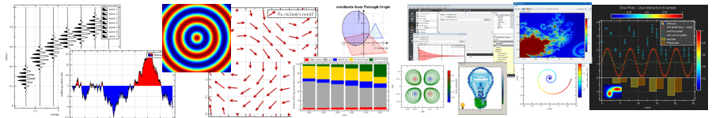
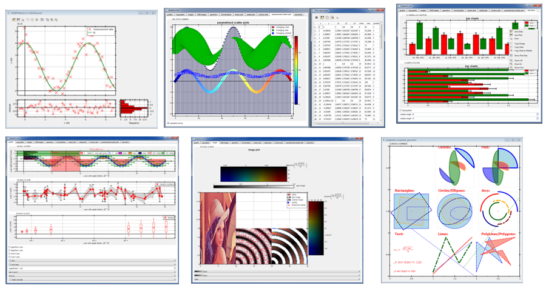

# JKQTPlotter - A Qt Plotting Library
This is an extensive library of function/data plotter classes for Qt (>= 4.7, tested with Qt up to 5.11).

This software is licensed under the term of the [GNU Lesser General Public License 2.1 
(LGPL 2.1)](./LICENSE) or above. 

[](https://github.com/jkriege2/JKQtPlotter/blob/master/LICENSE)

[](https://doc.qt.io/qt-5/)
[](http://jkriege2.github.io/JKQtPlotter/index.html)

[](https://ci.appveyor.com/project/jkriege2/jkqtplotter/branch/master) 
[](https://travis-ci.org/jkriege2/JKQtPlotter)

[](https://github.com/jkriege2/JKQtPlotter/pulse)
[](https://github.com/jkriege2/JKQtPlotter/issues)
[](https://github.com/jkriege2/JKQtPlotter/issues?q=is%3Aissue+is%3Aclosed)
[](https://github.com/jkriege2/JKQtPlotter/pulls)
[](https://github.com/jkriege2/JKQtPlotter/pulls?q=is%3Apr+is%3Aclosed)
[](https://github.com/jkriege2/JKQtPlotter/pulse)
[](https://github.com/jkriege2/JKQtPlotter/graphs/contributors)


## Main Features
- 2D Plotter class (JKQTPlotter)
  - high-quality plotting
  - no other dependencies than Qt >=4.7 (compatible with Qt 5.xx)
  - highly customizable axes/grids (linear/log, date/time, custom ticks ...)
  - integrated LaTeX parser (pure C++, no dependencies) to render mathematical equations in axis labels, ticks, ...
  - extensive user-interactions pre-programmed (several zooming modes, selecting regions, custom context menus, switch graph visibility, ...)
  - full print and export (PDF,PNG,...) support with preview and parametrization out-the-box
  - highly customizable look and feel
  - supports the Qt layout system for graphs and allows to symchronize several graphs with each other
- centralized data management in an internal datastore:
  - data organized by columns, can also represent image data (ropw-major)
  - allows to reuse a column in several graphs
  - access via Qt's model view framework
  - external or internal datasets
  - complete with GUI (table view)
  - export capabilities (e.g. to CSV, SYLK, ...)
  - C++ standard iterator interface
  - statistics library (basic statistics, boxplots, histograms, kernel density estimates, regression analysis, polynomial fitting)
- large variety of graphs that can be added to a plot, e.g.:
  - scatter-plots (also parametrized color/size/symbol by a third data-column)
  - line graphs, step graphs, impulses
  - filled curves
  - barcharts (also stacked)
  - extensive support for different styles of error indicators
  - integrated mathematical function parser for function plots (with intelligent rendering algorithm)
  - line/scatter graphs can also be based on C/C++ functions instead of data series (C++11 support!)
  - statistical plots (e.g. boxplots)
  - extensive library of image plots (inclusing different color-scale modes, RGBA-plots, overlays/masks)
  - contour plots
  - geometric forms/annotations
  - can be easily extended by deriving a new graph from JKQTPPlotElement or JKQTPPlotObject
- optional: OpenCV, CImg interfaces
- CMake-based build system
- extensive set of [Examples/Tutorials](./examples/README.md)
- extensive doxygen-generated [Documentation](http://jkriege2.github.io/JKQtPlotter/index.html)

## [Documentation](http://jkriege2.github.io/JKQtPlotter/index.html)
A Documentation (auto-)generated with [doxygen](http://www.doxygen.nl/) from the trunk source code can be found here: 
**[http://jkriege2.github.io/JKQTPlotter/index.html](http://jkriege2.github.io/JKQtPlotter/index.html)**

Documentation is auto-generated after pushes by [Travis](https://travis-ci.org/jkriege2/JKQtPlotter): [](https://travis-ci.org/jkriege2/JKQtPlotter)

## [Examples](./examples/)
There is a [large set of usage examples (with explanations for each) and tutorials](./examples/) in the folder [`./examples/`](./examples).
All test-projects are Qt-projects that use qmake to build. You can load them into QtCreator easily.

[](./examples/README.md)

## [Screenshots](./screenshots/)
The [Screenshots-page](./screenshots/) contains several screenshots, partly taken from the provided examples, but also from other software using this libarary (e.g. [QuickFit 3.0](https://github.com/jkriege2/QuickFit3))

[](./screenshots/README.md)


## Building

JKQTPlotter contains two different build systems: A modern [CMake](https://cmake.org/)-based build and an older (and deprecated!) QMake-based build (which works out of the box with Qt 5.x). Both systems are explained in detail in http://jkriege2.github.io/JKQtPlotter/page_buildinstructions.html.


With [CMake](https://cmake.org/) you can easily build JKQTPlotter and all its examples, by calling something like:
```
    $ mkdir build; cd build
    $ cmake .. -G "<cmake_generator>" "-DCMAKE_PREFIX_PATH=<path_to_your_qt_sources>"
    $ cmake --build . --config "Debug"
```

