# JKQtPlotter: Examples: Examples & Tutorials
This section assembles some simple examples of usage. 
You can find more (complex) examples for the classes in this repository in the subfolder "test". 
All test-projects are Qt-projects that use qmake to build. You can load them into QtCreator easily.

## Different Plot Data Styles

| Screenshot    | Description   | Notes         |
|:-------------:| ------------- | ------------- |
| [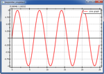](./simpletest) | [Very Basic Example (Line Graph)](./simpletest) | `JKQTPxyLineGraph`   C++-style QVector arrays of data |
|  | [Line Graph with Live Data / Speed Test](./simpletest_speed) | `JKQTPxyLineGraph`   external `std::array<double,N>` data, not owned by datastore   live-data, measure plotting speed   tipps to increas plotting speed |
| [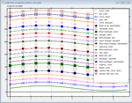](./simpletest_symbols_and_styles) | [Line Graph with Different Symbols and Line Styles](./simpletest_symbols_and_styles) | `JKQTPxyLineGraph`   C++ vector of data   setting line styles and symbol styles   automatic graph coloring |
| [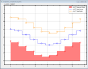](./simpletest_stepplots) | [Step Line Plots in Different Styles](./simpletest_stepplots) | `JKQTPstepHorizontalGraph` (and `JKQTPxyLineGraph`)   C++ vector of data   different step modes, filled and line-only |
|  | [Simple Line/Symbol Graph With Errorbars](./simpletest_symbols_and_errors) | `JKQTPxyLineErrorGraph`   C-style arrays of data |
|  | [Different Types of Error Indicators](./simpletest_errorbarstyles) | `JKQTPxyLineErrorGraph`   different styles of error indicators for x- and y-errors   C++-style QVector for data   styling error indicators   moving key and formatting plotter grid |
|  | [Simple Bar Charts](./simpletest_barchart) | `JKQTPbarVerticalGraph`   C-style arrays of data |
| [   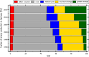](./simpletest_stackedbars) | [Stacked Bar Charts](./simpletest_stackedbars) | `JKQTPbarVerticalStackableGraph`, `JKQTPbarHorizontalStackableGraph`   C++-style vectors of data |
|  | [Filled Curve Plots](./simpletest_filledgraphs) | `JKQTPbarVerticalGraph`   setting/altering data in `JKQTPdatstore` directly    transparent plots   calculating histograms |
|  | [Impulse Plots](./simpletest_impulsesplot) | `JKQTPimpulsesVerticalGraph` and `JKQTPimpulsesHorizontalGraph`   C++-style QVector as plot data |
| [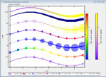](./simpletest_paramscatterplot) | [Scatter Graph with Parametrized Symbols/Colors](./simpletest_paramscatterplot) | `JKQTPxyParametrizedScatterGraph`   C++-style QVector as plot data   modify scatter/points/line-graph properties by data |
| [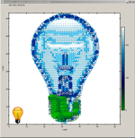](./simpletest_paramscatterplot_image) | [Draw an Artistic Image with a Parametrized Scatter Graph](./simpletest_paramscatterplot_image) | `JKQTPxyParametrizedScatterGraph`   C++-style QVector as plot data   rectangular arrangement of scatters   generative computer graphics |
|  | [Plotting Parametric Curves](./simpletest_parametriccurve) | `JKQTPxyLineGraph` and `JKQTPxyParametrizedScatterGraph`   C++-style QVector as plot data   parametric curve plotting |
|  | [Plotting Mathematical Functions as Line Graphs](./simpletest_functionplot) | `JKQTPxFunctionLineGraph`    diretly plotting C/C++-functions |
|  | [Plotting Parsed Mathematical Functions as Line Graphs](./simpletest_parsedfunctionplot) | `JKQTPxParsedFunctionLineGraph`    plotting functions with the internal math equation parser/evaluator |
|  | [Plotting Geometric Objects](./simpletest_geometric) |  |

## Styling the Plot, Keys, Axes, ...

| Screenshot    | Description   | Notes         |
|:-------------:| ------------- | ------------- |
| [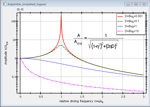](./simpletest_logaxes) | [logarithmic axes](./simpletest_logaxes) | `JKQTPxyLineGraph` and `JKQTPgeoText`   C++ vector of data   logarithmic axes and styling   plot line styles   internal LaTeX parser   add commenting text to a graph |
| [      ](./simpletest_dateaxes) | [date/time axes](./simpletest_dateaxes) | `JKQTPxyLineGraph` and `JKQTPfilledVerticalRangeGraph`   C++ vector of data   date/time axes   plot min/max range graph   internal LaTeX parser   data from CSV files |

## Image data Plots

| Screenshot    | Description   | Notes         |
|:-------------:| ------------- | ------------- |
|  | [`QImage` as a Graph](./simpletest_rgbimageplot_qt) | `JKQTPImage`   `QImage` drawn onto a plot with arbitrary scaling) |
| [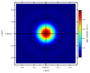](./simpletest_imageplot) | [Basic 1-channel Raw C Image Plot](./simpletest_imageplot) | `JKQTPColumnMathImage`   image data copied from C-style row-major array into a single column of the internal datastore   Describes several options of the image plotting classes (different ways of color coding, what to do with data above/below the limits etc.) |
| [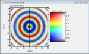](./simpletest_imageplot_modifier) | [Modifier-Feature of Image Plots](./simpletest_imageplot_modifier) | `JKQTPColumnMathImage`   image data copied from C-style row-major array into a single column of the internal datastore   Image is modified by a second image to display two data dimensions at the same time |
| [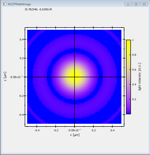](./simpletest_imageplot_nodatastore) | [Basic 1-channel Raw C Image Plot   without the internal datastore](./simpletest_imageplot_nodatastore) | `JKQTPMathImage`   image data in a C-style row-major array, not using internal datastore |
|  | [1-channel OpenCV cv::Mat Image Plot](./simpletest_imageplot_opencv) | `JKQTPColumnMathImage`   image data copied from OpenCV cv::Mat-structure into a single column of the internal datastore |
| [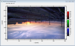](./simpletest_rgbimageplot_opencv) | [RGB OpenCV cv::Mat Image Plot](./simpletest_rgbimageplot_opencv) | `JKQTPColumnRGBMathImage`   image data copied from OpenCV cv::Mat-structure into three columns of the internal datastore |

## GUI Tools and Plot Layout

| Screenshot    | Description   | Notes         |
|:-------------:| ------------- | ------------- |
| [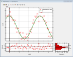](./test_multiplot) | [Layouting Several Plots](./test_multiplot) | Combining plots in Qt Layouts   linking plot axes   copy data from a `std::map` int the datastore   print plots/print preview |
| [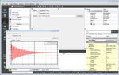](./simpletest_ui) | [Placing JKQtPlotter into a Qt User-Interface-XML-file (`*.ui`)](./simpletest_ui) | using Qt Form Designer   parsed function plots (`JKQTPxParsedFunctionLineGraph`) |

## Tools and Special Features

| Screenshot    | Description   | Notes         |
|:-------------:| ------------- | ------------- |
|  | [JKQTMathText: LaTeX Renderer](./jkqtmathtext_simpletest) |  |

