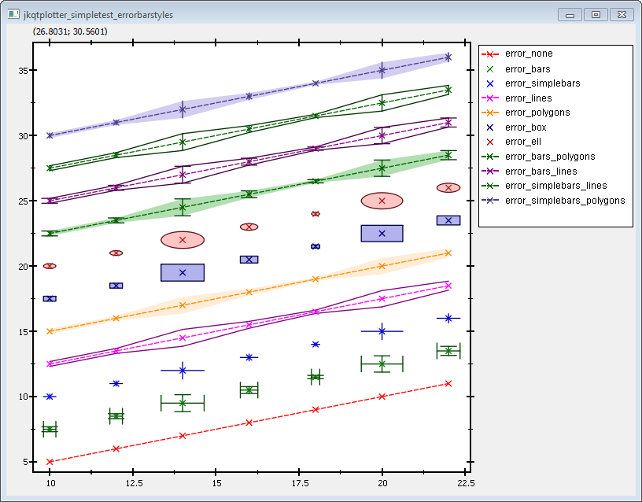
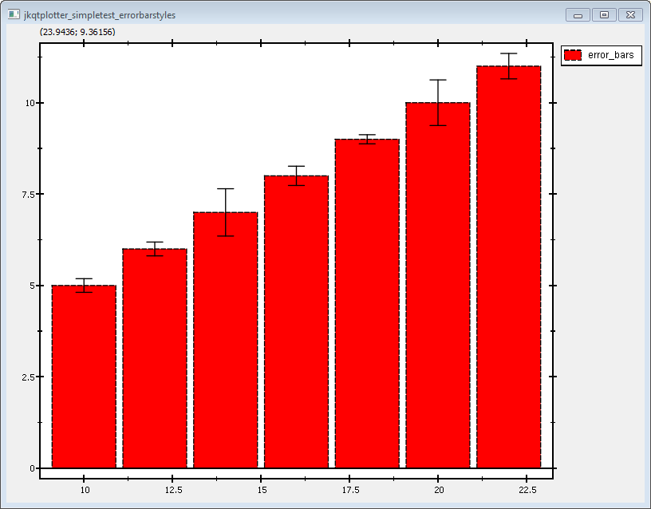
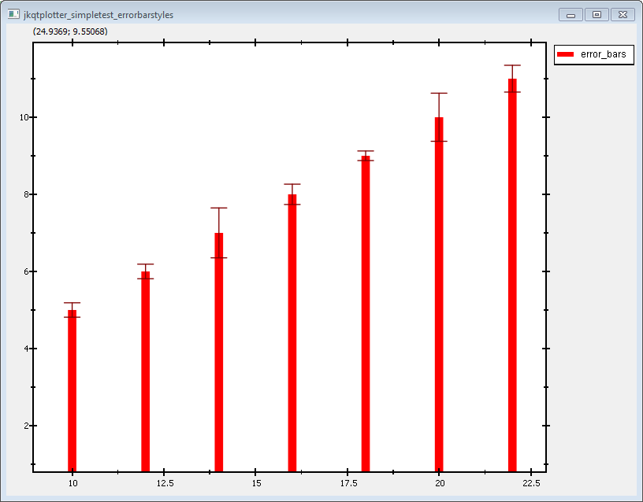
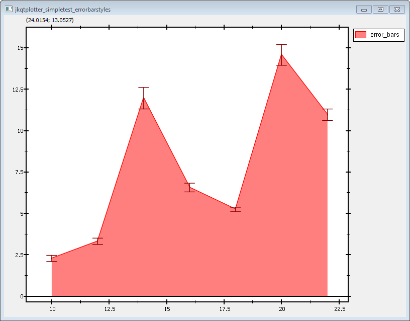

# JKQtPlotter: Examples: Different Types of Errorindicators {#JKQtPlotterErrorBarStyles}
This project (see `./examples/simpletest_errorbarstyles/`) simply creates a JKQtPlotter widget (as a new window) and adds several curves show-casing different styles of error indicators. Data is initialized from two QVector<double> objects.

The source code of the main application can be found in  [`jkqtplotter_simpletest_errorbarstyles.cpp`](../simpletest_errorbarstyles/jkqtplotter_simpletest_errorbarstyles.cpp). 

First some data is added to the internal datastore (mostly, like explained in several other examples, like e.g. [Line Graph with Different Symbols and Line Styles](../simpletest_symbols_and_styles)). The (in a loop) several graphs are added, each with a distinct style for its error indicators:

```c++
    // 3. now we make several plots with different error styles
    //    for that we iterate over every style from the vector errorStyles
    //    the array showXandYError indicates whether we want x- and y-error
    //    for a style for all stywhere this is false, only y-error-indicators
    //    are shown
	QVector<JKQTPerrorPlotstyle> errorStyles    {JKQTPnoError, JKQTPerrorBars, JKQTPerrorSimpleBars, JKQTPerrorLines, JKQTPerrorPolygons, JKQTPerrorBoxes, JKQTPerrorEllipses, JKQTPerrorBarsPolygons, JKQTPerrorBarsLines, JKQTPerrorSimpleBarsLines, JKQTPerrorSimpleBarsPolygons };
    QVector<bool>                showXandYError { false      , true          , true                , false          , false             , true           , true              , false                 , false              , false                    , false                        };

    for (int errorID=0; errorID<errorStyles.size(); errorID++) {
        // generate some plot data
        QVector<double> Y;
        for (auto& xx: X) {
            Y<<xx*0.5+static_cast<double>(errorID)*2.5;
        }

		// create a graph object
        JKQTPxyLineErrorGraph* graph=new JKQTPxyLineErrorGraph(&plot);

        // copy data into datastore and immediately set the yColumn
        graph->set_xColumn(columnX);
        graph->set_yColumn(ds->addCopiedColumn(Y, "y"+QString::number(errorID)));
        graph->set_xErrorColumn(columnXError);
        graph->set_yErrorColumn(columnYError);

        // set error style, for the y-axis
        graph->set_yErrorStyle(errorStyles[errorID]);
        // no error indicators for the x-values
        graph->set_xErrorStyle(JKQTPnoError);
        // ... unless: for some error styles we want error in both directions
        if (showXandYError[errorID]) {
            graph->set_xErrorStyle(errorStyles[errorID]);
            graph->set_drawLine(false);
        }
        // make error indicator 30% transparent
        QColor c=graph->get_errorFillColor();
        c.setAlphaF(0.3);
        graph->set_errorFillColor(c);
        // set error indicator line width
        graph->set_errorWidth(1);
        // set length of small bars at the end of error bars
        graph->set_errorbarSize(15);


        // set symbol (cross/X) + pen style (and color)dashed)
        graph->set_symbol(JKQTPcross);
        graph->set_style(Qt::DashLine);
        // set symbol size
        graph->set_symbolSize(5);
        // set width of symbol lines
        graph->set_symbolWidth(1);
        // set width of graph line
        graph->set_lineWidth(1);

        // graph title is made from symbol+errorStylestyle, we use the LaTeX instruction \verb around the
        // result of JKQTPerrorPlotstyle2String(), because it contains underscores that would otherwise
        // lead to lower-case letter, which we don't want
        graph->set_title("\\verb{"+JKQTPerrorPlotstyle2String(errorStyles[errorID])+"}");

        // add the graph to the plot, so it is actually displayed
        plot.addGraph(graph);
    }
```

The error styles are set in these lines:
```c++
	// set error style, for the y-axis
	graph->set_yErrorStyle(errorStyles[errorID]);
	// no error indicators for the x-values
	graph->set_xErrorStyle(errorStyles[errorID]);
```

There are several variables that can be used to further style the error indicator, like:
```c++
	// make error indicator 30% transparent
	QColor c=graph->get_errorFillColor();
	c.setAlphaF(0.3);
	graph->set_errorFillColor(c);
	// set error indicator line width
	graph->set_errorWidth(1);
	// set length of small bars at the end of error bars
	graph->set_errorbarSize(15);
```

There are more properties that you can find in the documentation of the mix-in classes `JKQTPxyGraphErrors`, `JKQTPxGraphErrors`, `JKQTPyGraphErrors`, `JKQTPgraphErrors`.

In addition the plot key is moved outside the pot and the grid in the plot is switched off:
```c++
    // 6. change locaion of key (outside top-right)
    plot.get_plotter()->set_keyPosition(JKQTPkeyOutsideRightTop);
    // ... and switch off the grid
    plot.get_xAxis()->set_drawGrid(false);
    plot.get_xAxis()->set_drawMinorGrid(false);
    plot.get_yAxis()->set_drawGrid(false);
    plot.get_yAxis()->set_drawMinorGrid(false);
```

The result looks like this:



Error bars are implemented in the mixin-classes `JKQTPxyGraphErrors`, `JKQTPxGraphErrors` and `JKQTPyGraphErrors` that are all derived from `JKQTPgraphErrors`. With these it is simple to add error indicators to several different plot styles. Usually you can recognize these by looking at the class name, e.g. `JKQTPxyLineGraph` is a simple line+symbol graph, and `JKQTPxyLineErrorGraph` is the same with error indictaors (see above). There are also several other plots with error indicators:
  - `JKQTPbarVerticalErrorGraph` for barcharts with errors:<br>
  - `JKQTPimpulsesVerticalGraph` for impulse/candle-stick charts with errors:<br>
  - `JKQTPfilledCurveXErrorGraph` for filled curves with errors:<br>
.


