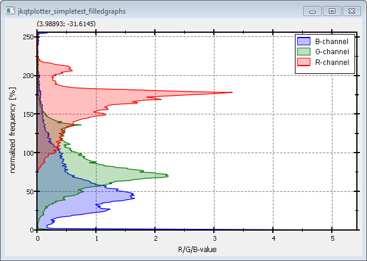

# Example (JKQTPlotter): Filled Curve Plots {#JKQTPlotterFilledGraphs}
This project (see `./examples/simpletest_filledgraphs/`) simply creates a JKQTPlotter widget (as a new window) and adds several filled curve graphs (Histograms). Data is initialized from QVector<int> objects.

The source code of the main application can be found in  [`jkqtplotter_simpletest_filledgraphs.cpp`](../simpletest_filledgraphs/jkqtplotter_simpletest_filledgraphs.cpp). 

First the data columns for three x-y-curves are generated. One column of x-values with entries 0,1,2,...,254,255 (256 entries). 
```.cpp
    size_t columnX=ds->addLinearColumn(256, 0, 255, "x");
```

And three columns with 256 entries each, which will be filled with the R-, G- and B-histograms of an image `example.bmp`:
```.cpp
    size_t columnR=ds->addColumn(256, "historam_R");
    size_t columnG=ds->addColumn(256, "historam_G");
    size_t columnB=ds->addColumn(256, "historam_B");
```
	
In this example we will access the data in the internal datastore directly. This access is possible through objects of type JKQTPColumn, which is a proxy to the data in one of the columns in a `JKQTdatastore`:

```.cpp
    JKQTPColumn cG=ds->getColumn(columnG);
    JKQTPColumn cR=ds->getColumn(columnR);
    JKQTPColumn cB=ds->getColumn(columnB);
```

In order to calculate the histograms, first all enries in the columns are set to 0:

```.cpp
    cR.setAll(0);
    cG.setAll(0);
    cB.setAll(0);
```

Finally the histogram is calculated:

```.cpp
    QImage image(":/example.bmp");
    for (int y=0; y<image.height(); y++) {
        for (int x=0; x<image.width(); x++) {
            QRgb pix=image.pixel(x,y);
            cR.incValue(qRed(pix), 1);
            cG.incValue(qGreen(pix), 1);
            cB.incValue(qBlue(pix), 1);
        }
    }
    cR.scale(100.0/static_cast<double>(image.width()*image.height()));
    cG.scale(100.0/static_cast<double>(image.width()*image.height()));
    cB.scale(100.0/static_cast<double>(image.width()*image.height()));
```

Finally three `JKQTPFilledCurveXGraph` objects are generated and added to the plot (here we show the code for the R-channel only):

```.cpp
    JKQTPFilledCurveXGraph* graphR=new JKQTPFilledCurveXGraph(&plot);

    // set graph titles
    graphR->setTitle("R-channel");

    // set graph colors (lines: non-transparent, fill: semi-transparent
    QColor col;
    col=QColor("red"); graphR->setColor(col);
    col.setAlphaF(0.25); graphR->setFillColor(col);

    // set data
    graphR->setXColumn(columnX); graphR->setYColumn(columnR);


    // add the graphs to the plot, so they are actually displayed
    plot.addGraph(graphR);
```

The curves are fille with a semi-transparent color, which is achieved by setting `col.setAlphaF(0.25)` on the graph color `col`.

The result looks like this:


If you use `JKQTPFilledCurveYGraph` instead of `JKQTPFilledCurveXGraph`, the curve will not be filled until the y=0-axis, but until the x=0-axis. Of course you will also have to swap the x- and y-data columns. The result will look like this:




