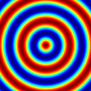
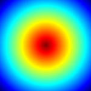
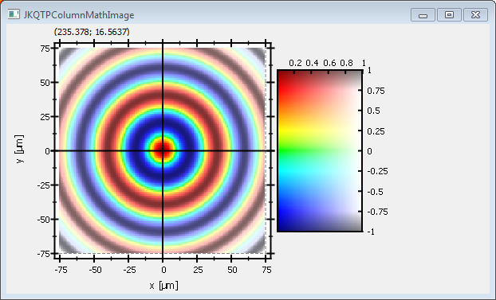

# JKQtPlotter: Examples: Simple math image plot {#JKQtPlotterImagePlotModifier}
This project (see `./examples/simpletest_imageplot_modifier/`) creates a JKQtPlotter widget (as a new window) and adds a color-coded image plot of a mathematical function (here `sin(r)`). Then a second image (linearly scaling from 1 in the center to 0 at the borders) is used to modify the first image. The modification can alter several properties of the original image, like its saturation, its transparency (alpha) ...

The soruce code of the main application is (see [`jkqtplotter_simpletest_imageplot_modifier.cpp`](../simpletest_imageplot_modifier/jkqtplotter_simpletest_imageplot_modifier.cpp):
```c++
#include <QApplication>
#include <cmath>
#include "jkqtplotter/jkqtplotter.h"
#include "jkqtplotter/jkqtpgraphsimage.h"

#ifndef M_PI
#define M_PI 3.14159265358979323846
#endif


int main(int argc, char* argv[])
{
    QApplication app(argc, argv);

    JKQtPlotter plot;
    // 1. create a plotter window and get a pointer to the internal datastore (for convenience)
    plot.get_plotter()->set_useAntiAliasingForGraphs(true); // nicer (but slower) plotting
    plot.get_plotter()->set_useAntiAliasingForSystem(true); // nicer (but slower) plotting
    plot.get_plotter()->set_useAntiAliasingForText(true); // nicer (but slower) text rendering
    JKQTPdatastore* ds=plot.getDatastore();

    // 2. now we create data for the charts (taken from https://commons.wikimedia.org/wiki/File:Energiemix_Deutschland.svg)
    const int NX=150; // image dimension in x-direction [pixels]
    const int NY=150; // image dimension in x-direction [pixels]
    double image[NX*NY]; // row-major image
    double modifier[NX*NY]; // row-major modfier image

    // 2 calculate image of airy disk in a row-major array
    double x, y=-static_cast<double>(NY)/2.0;
    for (int iy=0; iy<NY; iy++ ) {
        x=-static_cast<double>(NX)/2.0;
        for (int ix=0; ix<NX; ix++ ) {
            const double r=sqrt(x*x+y*y);
            image[iy*NX+ix] = cos(M_PI*r/20.0);
            modifier[iy*NX+ix] = 1.0-r/sqrt(NX*NX/4.0+NY*NY/4.0);
            x+=1;
        }
        y+=1;
    }


    // 3. make data available to JKQtPlotter by adding it to the internal datastore.
    //    In this step the contents of C-array airydisk is copied into a column
    //    of the datastore in row-major order
    size_t cImage=ds->addCopiedImageAsColumn(image, NX, NY, "imagedata");
    size_t cModifier=ds->addCopiedImageAsColumn(modifier, NX, NY, "modifier");

	
    // 4. create a graph (JKQTPColumnMathImage) with the column created above as data
    //    The data is color-coded with the color-palette JKQTPMathImageMATLAB
    //    the converted range of data is determined automatically because set_autoImageRange(true)
    JKQTPColumnMathImage* graph=new JKQTPColumnMathImage(&plot);
    graph->set_title("");
    // image column with the data
    graph->set_imageColumn(cImage);
    // now set the modifier image:
    graph->set_modifierColumn(cModifier);
    graph->set_autoModifierRange(true);
    // ... and specify which image property is modified (here the saturation, but ModifyAlpha for the transparency and ModifyValue from the HSV color-model are also possible):
    graph->set_modifierMode(JKQTPMathImageBase::ModifySaturation);
    // set size of the data (the datastore does not contain this info, as it only manages 1D columns of data and this is used to assume a row-major ordering
    graph->set_Nx(NX);
    graph->set_Ny(NY);
    // where does the image start in the plot, given in plot-axis-coordinates (bottom-left corner)
    graph->set_x(-NX/2.0);
    graph->set_y(-NX/2.0);
    // width and height of the image in plot-axis-coordinates
    graph->set_width(NX);
    graph->set_height(NY);
    // color-map is "MATLAB"
    graph->set_palette(JKQTPMathImageMATLAB);
    // determine min/max of data automatically and use it to set the range of the color-scale
    graph->set_autoImageRange(true);


	
	
    // 5. add the graphs to the plot, so it is actually displayed
    plot.addGraph(graph);

	
    // 6. set axis labels
    plot.get_xAxis()->set_axisLabel("x [{\\mu}m]");
    plot.get_yAxis()->set_axisLabel("y [{\\mu}m]");

	
    // 7. fix axis and plot aspect ratio to 1
    plot.get_plotter()->set_maintainAspectRatio(true);
    plot.get_plotter()->set_maintainAxisAspectRatio(true);

    // 8 autoscale the plot so the graph is contained
    plot.zoomToFit();

    // show plotter and make it a decent size
    plot.show();
    plot.resize(500,500);
    plot.setWindowTitle("JKQTPColumnMathImage");


    return app.exec();
}
```
The data image (`sin(r/30)`) on its own looks like this:<br>
<br>
and the modifier image on its own would look like this:<br>


Combined the two form this plot:<br>



See [`test/simpletest_imageplot`](../simpletest_imageplot) for a detailed description of the other possibilities that the class JKQTPColumnMathImage (and also JKQTPMathImage) offer with respect to determining how an image is plotted. You can combine all options there with the modifier feature described here.


