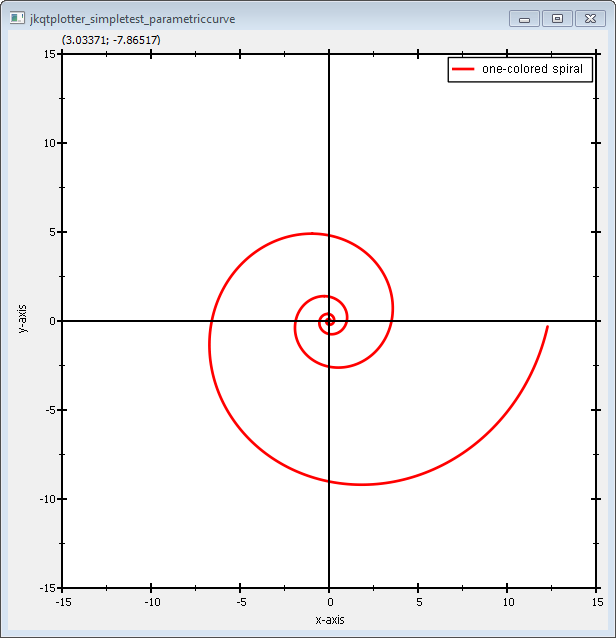
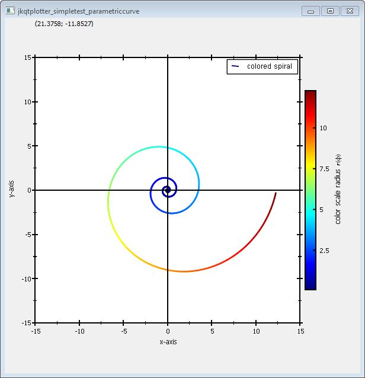

# Example (JKQTPlotter): Plotting Parametric Curves {#JKQTPlotterParametricCurves}
This project (see `./examples/simpletest_parametriccurve/`) demonstrates how to draw parametric curves, using [`JKQTPXYLineGraph`}(../simpletest) and [`JKQTPXYParametrizedScatterGraph`](../simpletest_paramscatterplot). 

The source code of the main application can be found in  [`jkqtplotter_simpletest_parametriccurve.cpp`](../simpletest_parametriccurve/jkqtplotter_simpletest_parametriccurve.cpp). First, the parametric curve (here a [logarithic spiral](https://en.wikipedia.org/wiki/Logarithmic_spiral)) is sampled into two columns containing the x- and y-values along the curve. In addition the radial distance from x=y=0 is added into a third column:
```.cpp
    QVector<double> X, Y, R;
    const int Ndata=500; // number of plot points in each curve
    const double phiMax=4.0*M_PI;
    const double a=1;
    const double k=0.2;
    for (double phi=-phiMax; phi<=phiMax; phi+=phiMax/double(Ndata)) {
        const double x=a*exp(k*phi)*cos(phi);
        const double y=a*exp(k*phi)*sin(phi);
        X<<x;
        Y<<y;
        R<<sqrt(x*x+y*y);
    }
    // and copy it to the datastore
    size_t columnX=ds->addCopiedColumn(X, "x");
    size_t columnY=ds->addCopiedColumn(Y, "y");
    size_t columnR=ds->addCopiedColumn(R, "r");
```


Then simples graph just uses the columns X and Y to plot the curve:
```.cpp
    JKQTPXYLineGraph* graph1=new JKQTPXYLineGraph(&plot);
    graph1->set_xColumn(columnX);
    graph1->set_yColumn(columnY);
    graph1->set_drawLine(true);
    graph1->set_symbol(JKQTPNoSymbol);
    graph1->set_title("one-colored spiral");
    plot.addGraph(graph1);
```
 
If you use `JKQTPXYParametrizedScatterGraph` instead of `JKQTPXYLineGraph`, you can also modify the color of the line-segments, connecting the datapoints:
```.cpp
    JKQTPXYParametrizedScatterGraph* graph2=new JKQTPXYParametrizedScatterGraph(&plot2);
    graph2->set_xColumn(columnX);
    graph2->set_yColumn(columnY);
    graph2->set_colorColumn(columnR);
    graph2->set_palette(JKQTPMathImageMATLAB);
    graph2->set_symbol(JKQTPNoSymbol);
    graph2->set_drawLine(true);
    graph2->set_title("colored spiral");
    graph2->get_colorBarRightAxis()->set_axisLabel("color scale radius $r(\\phi)$");
    plot2.addGraph(graph2);
```

The result looks like this:



... and with the line-color set by the radius:




