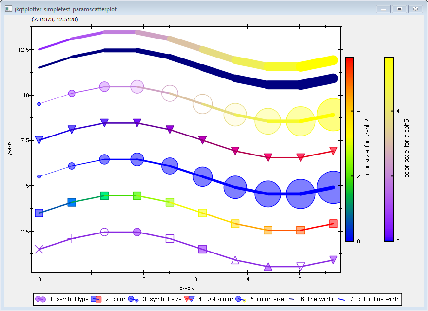

# JKQtPlotter: Examples: Scatter Graph with Parametrized Symbols/Colors {#JKQtPlotterParamScatter}
This project (see `./examples/simpletest_paramscatterplot/`) demonstrates the capabilities of `JKQTPxyParametrizedScatterGraph`. This graph class plots symbol&line-graphs, juts like [`JKQTPxyLineGraph`](../simpletest_symbols_and_styles/) and in addition modifies several properties of each plot point by data from an additional column. These properties can be modified:
- symbol size
- symbol type
- symbol/line color
- line width

The source code of the main application can be found in  [`jkqtplotter_simpletest_paramscatterplot.cpp`](../simpletest_paramscatterplot/jkqtplotter_simpletest_paramscatterplot.cpp). First, several datasets are generated and added to the internal datastore. the resulting datatable looks like this:


Then several plots are added that modify different properties.

The simplest case is to modify the symbol type. Simply set the property `symbolColumn` with `graph1->set_symbolColumn(columnP)` to a data column. The values in the data column will be cast to an integer and then will be translated to `JKQTPgraphSymbols`. If the numbers are larger than the available symbol types in `JKQTPgraphSymbols`, the graph will cycle through the available symbols (via a modulo-operation with the max. symbol count!).
```c++
	JKQTPxyParametrizedScatterGraph* graph1=new JKQTPxyParametrizedScatterGraph(&plot);
    graph1->set_xColumn(columnX);
    graph1->set_yColumn(columnY1);
    graph1->set_symbolColumn(columnP);
    graph1->set_drawLine(true);
    graph1->set_color(QColor("blueviolet"));
    graph1->set_title("1: symbol type");
    plot.addGraph(graph1);
```


The next two code snippets show how to modify the size of the symbols and the line width of the lines, connecting the symbols (ensure to set `graph6->set_drawLine(true)`, because otherwise no line will be drawn). The principle is the same as above, but here you need to set the properties `sizeColumn` for the symbol size and `linewidthColumn` for the line width. All values in the line width or symbol size columns are interpreted as sizes in dtp points (pt)!
```c++
    // symbol size
    JKQTPxyParametrizedScatterGraph* graph3=new JKQTPxyParametrizedScatterGraph(&plot);
    graph3->set_xColumn(columnX);
    graph3->set_yColumn(columnY3);
    graph3->set_sizeColumn(columnS);
    graph3->set_symbol(JKQTPfilledCircle);
    graph3->set_drawLine(true);
    graph3->set_title("3: symbol size");
    plot.addGraph(graph3);

	// line width
    JKQTPxyParametrizedScatterGraph* graph6=new JKQTPxyParametrizedScatterGraph(&plot);
    graph6->set_xColumn(columnX);
    graph6->set_yColumn(columnY6);
    graph6->set_linewidthColumn(columnLW);
    graph6->set_drawLine(true);
    graph6->set_symbol(JKQTPnoSymbol);
    graph6->set_title("6: line width");
    plot.addGraph(graph6);
```


Finally you can set the color of each symbol, based on data in the column `colorColumn`. Here two possibilities exist: First you can store the RGB(A) value for each datapoint explicitly. For this, you first need to create the data in the column, using the Qt-function [`qRgb()`](http://doc.qt.io/qt-5/qcolor.html#qRgb) or [`qRgba()`}(http://doc.qt.io/qt-5/qcolor.html#qRgba):
```c++
    QVector<double> RGB;
    const int Ndata=10; // number of plot points in each curve
    for (int i=0; i<Ndata; i++) {
        const double x=double(i)/double(Ndata)*2.0*M_PI;
        RGB<<double(qRgb(double(i)/double(Ndata)*255,0,255-double(i)/double(Ndata)*255));
    }
    size_t columnRGB=ds->addCopiedColumn(RGB, "rgb");
```c++
Basically the data points in a RGB(A)-column will be interpreted by castig them to [`QRgb`](http://doc.qt.io/qt-5/qcolor.html#QRgb-typedef).

Now you can add the graph. In order to interpret the color column as RGB(A)-values, ensure to set `graph4->set_colorColumnContainsRGB(true)`:
```c++
    JKQTPxyParametrizedScatterGraph* graph4=new JKQTPxyParametrizedScatterGraph(&plot);
    graph4->set_xColumn(columnX);
    graph4->set_yColumn(columnY4);
    graph4->set_colorColumn(columnRGB);
    graph4->set_colorColumnContainsRGB(true);
    graph4->set_drawLine(true);
    graph4->set_symbol(JKQTPfilledDownTriangle);
    graph4->set_title("4: RGB-color");
    plot.addGraph(graph4);
```

The second variant for setting the color of each datapoint is by mapping the values in the column to a color palette (`JKQTPMathImageRYGB` in this example). For this you simply need to define the color coumn and the palette to use. By default, the color palette spans the full range of values in `colorColumn`:
```c++
    JKQTPxyParametrizedScatterGraph* graph2=new JKQTPxyParametrizedScatterGraph(&plot);
    graph2->set_xColumn(columnX);
    graph2->set_yColumn(columnY2);
    graph2->set_colorColumn(columnC);
    graph2->set_palette(JKQTPMathImageRYGB);
    graph2->set_symbol(JKQTPfilledRect);
    graph2->set_drawLine(true);
    graph2->set_title("2: color");
    graph2->get_colorBarRightAxis()->set_axisLabel("color scale for graph2");
    plot.addGraph(graph2);
```
Note: If you want to set the range manually, use `ste_imageMin()` and `set_imageMax()` after setting `set_autoImageRange(false)`.


Note also that it is possible to combine any of parametrizations above in a single graph, by setting two or more columns:
```c++
    JKQTPxyParametrizedScatterGraph* graph5=new JKQTPxyParametrizedScatterGraph(&plot);
    graph5->set_xColumn(columnX);
    graph5->set_yColumn(columnY5);
    graph5->set_colorColumn(columnC);
    graph5->set_sizeColumn(columnS);
    graph5->set_palette(JKQTPMathImageBLUEYELLOW);
    graph5->set_drawLine(true);
    graph5->set_title("5: color+size");
    graph5->get_colorBarRightAxis()->set_axisLabel("color scale for graph5");
    plot.addGraph(graph5);
```


The full test appication combines all these variants and the result looks like this:




