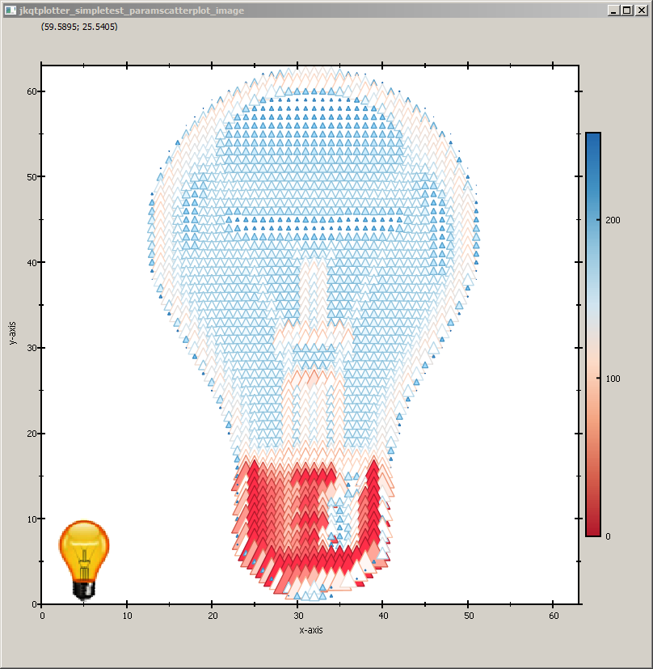
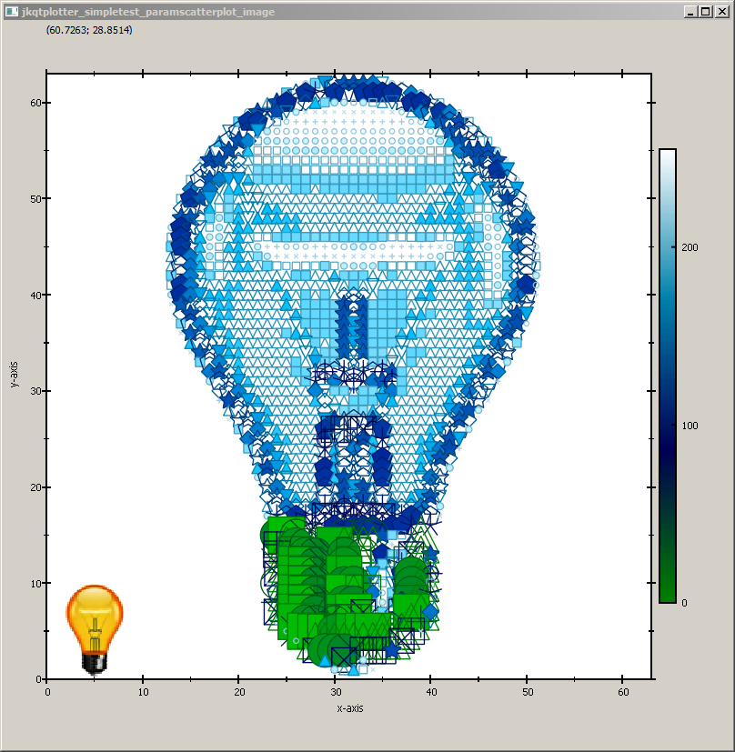

[Back to JKQTPlotter main page](../../README.md)

# JKQtPlotter

## Draw an Artistic Image with a Parametrized Scatter Graph
This project (see `./examples/simpletest_paramscatterplot_image/`) demonstrates the capabilities of `JKQTPxyParametrizedScatterGraph` to display parametrized scatters in a rectangular arrangement. See the test program in [`test/simpletest_paramscatterplot`](../simpletest_paramscatterplot) for a basic example of the capabilities of `JKQTPxyParametrizedScatterGraph`.

In this example, we load an image, convert it to greyscale and store it, together with x/y-coordinate-vectors in the datastore. Then a `JKQTPxyParametrizedScatterGraph` is used to draw the image as a pointilistic artwork, where each pixel is represented by a disk. The color of the disk is chosen from a color-palette, based on the grey-value. The size of each disk is chosen from the inverse grey value.

First we prepare the data, as described above. The image is loaded and then converted to the required data vectors.
```c++
    // 2.1 load image
    QImage image(":/example.bmp");
    QVector<double> imageVector, pointSizes;
    QVector<double> X,Y;

    // 2.2 convert image to greyscale, stored in a vector in row-major order
    double maxSymbolSize=30; // maximal diameter of symbols in pt
    for (int y=0; y<image.height(); y++) {
        for (int x=0; x<image.width(); x++) {
            // calculate grey-value image vector
            imageVector.push_back(qGray(image.pixel(x,y)));
            // calculate point sizes from inverse grey value and scaling between 0 and maxSymbolSize
            pointSizes.push_back(static_cast<double>(255-qGray(image.pixel(x,y)))/255.0*maxSymbolSize);
            // calculate X/Y-coordinates (y mirrored, so image is upright)
            X.push_back(x);
            Y.push_back(image.height()-1-y);
        }
    }

    // 2.3 and copy it to the datastore
    size_t columnX=ds->addCopiedColumn(X, "x");
    size_t columnY=ds->addCopiedColumn(Y, "y");
    size_t columnG=ds->addCopiedColumn(imageVector, "greyscaleImageData");
    size_t columnS=ds->addCopiedColumn(pointSizes, "pointSizes");
```

Now we can use th datavectors to add a `JKQTPxyParametrizedScatterGraph`:
```c++
    JKQTPxyParametrizedScatterGraph* graph1=new JKQTPxyParametrizedScatterGraph(&plot);
    graph1->set_xColumn(columnX);
    graph1->set_yColumn(columnY);
    graph1->set_sizeColumn(columnS);
    graph1->set_symbol(JKQTPfilledCircle);
    graph1->set_colorColumn(columnG);
    graph1->set_palette(JKQTPMathImageMATLAB);
    graph1->set_drawLine(false);
    graph1->set_title("");
    plot.addGraph(graph1);
```

For illustrative purposes, the original image is shown at the bottom-left:
```c++
    JKQTPImage* graph2=new JKQTPImage(&plot);
    graph2->set_image(image);
    graph2->set_x(0);
    graph2->set_y(0);
    graph2->set_width(10);
    graph2->set_height(10);
    plot.addGraph(graph2);
```

Finally the plot is styled and the axis aspect ratios are fixed:
```c++
    // scale the plot so the graph is contained and format the coordinate system
    plot.get_xAxis()->set_axisLabel("x-axis");
    plot.get_yAxis()->set_axisLabel("y-axis");
    plot.get_xAxis()->set_drawGrid(false);
    plot.get_yAxis()->set_drawGrid(false);
    // max. size is the size of the image
    plot.setXY(0,image.width()-1,0,image.height()-1);
    plot.setAbsoluteXY(0,image.width()-1,0,image.height()-1);
    // ensure that axis aspect ration and coordinate system aspect ratio are maintained
    plot.get_plotter()->set_maintainAspectRatio(true);
    plot.get_plotter()->set_aspectRatio(1);
    plot.get_plotter()->set_maintainAxisAspectRatio(true);
    plot.get_plotter()->set_axisAspectRatio(1);
```

The full test appication combines all these variants and the result looks like this:


You can modify the example above in several ways, e.g. by choosing another symbol (e.g. a star):


... or by changing the color palette and the symbol:




... or even  to set a different symbol for each pixel, based on the values in `columnS` (simply add `graph1->set_symbolColumn(columnS)`):




[Back to JKQTPlotter main page](../../README.md)