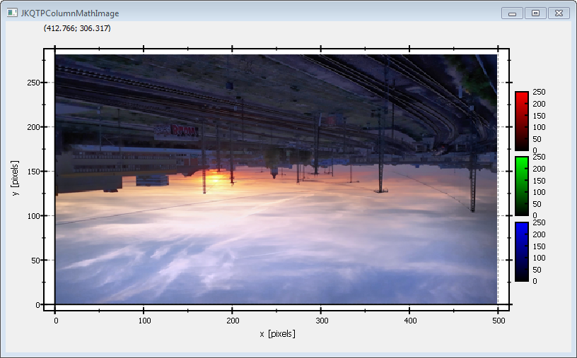

# Example (JKQTPlotter): Simple RGB image plot, showing a 3-channel OpenCV cv::Mat {#JKQTPlotterImagePlotRGBOpenCV}
This project (see `./examples/simpletest_imageplot_opencv/`) simply creates a JKQTPlotter widget (as a new window) and adds a color-coded image plot of a mathematical function (here the Airy disk). The image is generated as an OpenCV cv::Mat image and then copied into a single column of the internal datasdtore (JKQTPMathImage could be directly used without the internal datastore). 
To copy the data a special OpenCV Interface function `JKQTPCopyCvMatToColumn()` is used, that copies the data from a cv::Mat directly into a column. 

The function `JKQTPCopyCvMatToColumn()` is available from the (non-default) header-only extension from `jkqtplotter/jkqtpopencvinterface.h`. This header provides facilities to interface JKQTPlotter with OPenCV.

The source code of the main application is (see [`jkqtplotter_simpletest_imageplot_opencv.cpp`](../simpletest_imageplot_opencv/jkqtplotter_simpletest_imageplot_opencv.cpp):
```.cpp
#include <QApplication>
#include <cmath>
#include "jkqtplotter/jkqtplotter.h"
#include "jkqtplotter/jkqtpgraphsimage.h"
#include "jkqtplotter/jkqtpopencvinterface.h"
#include <opencv2/core.hpp>
#include <opencv2/imgcodecs.hpp>


int main(int argc, char* argv[])
{
    QApplication app(argc, argv);

    JKQTPlotter plot;


    // 1. create a plotter window and get a pointer to the internal datastore (for convenience)
    plot.getPlotter()->setUseAntiAliasingForGraphs(true); // nicer (but slower) plotting
    plot.getPlotter()->setUseAntiAliasingForSystem(true); // nicer (but slower) plotting
    plot.getPlotter()->setUseAntiAliasingForText(true); // nicer (but slower) text rendering
    JKQTPDatastore* ds=plot.getDatastore();


    // 2. now we open a BMP-file and load it into an OpenCV cv::Mat
    cv::Mat picture = cv::imread("example.bmp");


    // 3. make data available to JKQTPlotter by adding it to the internal datastore.
    //    In this step the contents of each channel of the openCV cv::Mat is copied into a column
    //    of the datastore in row-major order
    size_t cPictureR=JKQTPCopyCvMatToColumn(ds, picture, "R-channel", 2);
    size_t cPictureG=JKQTPCopyCvMatToColumn(ds, picture, "G-channel", 1);
    size_t cPictureB=JKQTPCopyCvMatToColumn(ds, picture, "B-channel", 0);


    // 4. create a graph (JKQTPColumnRGBMathImage) with the columns created above as data
    JKQTPColumnRGBMathImage* graph=new JKQTPColumnRGBMathImage(&plot);
    graph->setTitle("");
    // set size of the data (the datastore does not contain this info, as it only manages 1D columns of data and this is used to assume a row-major ordering
    graph->setNx(picture.cols);
    graph->setNy(picture.rows);
    // where does the image start in the plot, given in plot-axis-coordinates (bottom-left corner)
    graph->setX(0);
    graph->setY(0);
    // width and height of the image in plot-axis-coordinates
    graph->setWidth(picture.cols);
    graph->setHeight(picture.rows);
    // image column with the data
    graph->setImageRColumn(cPictureR);
    graph->setImageGColumn(cPictureG);
    graph->setImageBColumn(cPictureB);
    // determine min/max of each channel manually
    graph->setImageMinR(0);
    graph->setImageMaxR(255);
    graph->setImageMinG(0);
    graph->setImageMaxG(255);
    graph->setImageMinB(0);
    graph->setImageMaxB(255);


    // 5. add the graphs to the plot, so it is actually displayed
    plot.addGraph(graph);

    // 6. set axis labels
    plot.getXAxis()->setAxisLabel("x [pixels]");
    plot.getYAxis()->setAxisLabel("y [pixels]");

    // 7. fix axis aspect ratio to width/height, so pixels are square
    plot.getPlotter()->setMaintainAspectRatio(true);
    plot.getPlotter()->setAspectRatio(double(picture.cols)/double(picture.rows));

    // 8. autoscale the plot so the graph is contained
    plot.zoomToFit();

    // show plotter and make it a decent size
    plot.show();
    plot.resize(800,600);
    plot.setWindowTitle("JKQTPColumnMathImage");


    return app.exec();
}

```
The result looks like this:



The image is upside-down, because computer images use a coordinate system with 0 at the top-left (left-handed coordinate system) and the JKQTPlotter has its 0 at the bottom-left (right-handed coordinate system).


