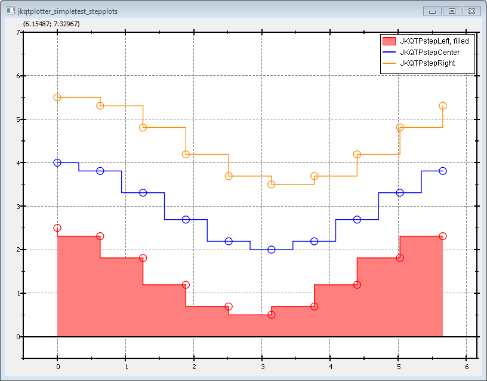

# Example (JKQTPlotter): Step Line Plots in Different Styles {#JKQTPlotterStepPlot}
This project (see `./examples/simpletest_stepplots/`) simply creates a JKQTPlotter widget (as a new window) and adds a single line-graph (a sine-wave). Data is initialized from two QVector<double> objects.

The source code of the main application can be found in  [`jkqtplotter_simpletest_stepplots.cpp`](../simpletest_stepplots/jkqtplotter_simpletest_stepplots.cpp). For the most part, several datasets of cosine-curves are generated. then thrre tuples of graphs are added: One of type `JKQTPXYLineGraph`, which simply indicates the location of the actual datapoints. the second is of type `JKQTPStepHorizontalGraph`, which adds the step-graph to the plot:

```.cpp
	// 3 now we make several plots with different step styles, each one also contains a
    //     symbol plot indicating the location of the datapoints themselves
    JKQTPStepHorizontalGraph* graph;
    JKQTPXYLineGraph* graphL;

    //-- JKQTPStepLeft ----------------------------------------------------------------------------------------
    graph=new JKQTPStepHorizontalGraph(&plot);
    graphL=new JKQTPXYLineGraph(&plot);

    // set data for both graphs
    graph->setXColumn(columnX); graphL->setXColumn(graph->getXColumn());
    graph->setYColumn(columnY1); graphL->setYColumn(graph->getYColumn());

    // set step style
    graph->setStepType(JKQTPStepLeft);
    graph->setLineWidth(1);
    graph->setFillCurve(true);
    graph->setDrawLine(true);
    graph->setTitle("JKQTPStepLeft, filled");
```
Note that you can configure the step type (left/center/right by `graph->setStepType(JKQTPStepLeft)`. With `graph->setFillCurve(true)` you can draw the curve filled until the y=0-axis and with `graph->setDrawLine(true)` you can switch the line along the values on and off (e.g. to only have the filled area, but no line).

Finally the `JKQTPXYLineGraph` is configured:
```.cpp
    // set symbol + pen style and color for the added circles, copy color
    graphL->setSymbol(JKQTPGraphSymbols::JKQTPCircle);
    graphL->setDrawLine(false);
    graphL->setSymbolSize(9);
    graphL->setSymbolWidth(1);
    graphL->setColor(graph->getColor());
```

... and all graphs are added to the plot:
```.cpp
    // add the graphs to the plot, so it is actually displayed
    plot.addGraph(graph);
    plot.addGraph(graphL);
```

In addition to the symbol type and line style, you can also alter the size of the symbols (`graph->setSymbolSize(14)`), the line-width used to draw them (`graph->setSymbolWidth(1.5)`) and the line width of the graph line (`graph->setLineWidth(1)`). If you want to switch off the line altogether, use `graph->setDrawLine(false`.

The result looks like this:




