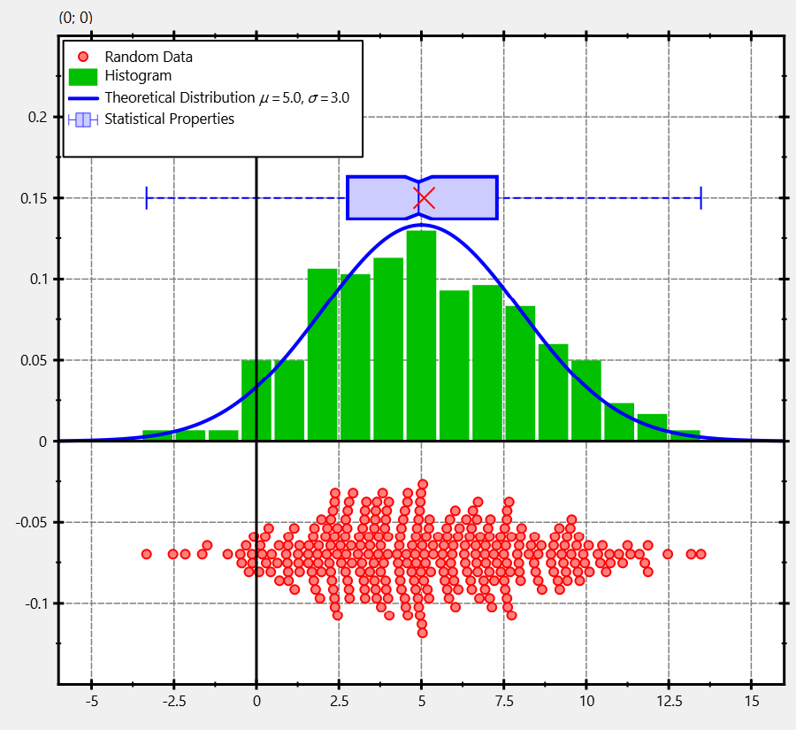

# Example (JKQTPlotter): Plotting a Statistical Distribution of Data {#JKQTPlotterDistributionPlot}
This project (see [`test_distributionplot`](../test_distributionplot) demonstrates how to combine several different graphs and geometric elements to show a set of random values and their statistics.

The source code of the main application is (see [`test_distributionplot.cpp`](test_distributionplot.cpp).

After adding all necessary data to the JKQTDatastore:
```.cpp
    // 1. create a plotter window and get a pointer to the internal datastore (for convenience)
    JKQTPlotter plot;
    plot.getPlotter()->setUseAntiAliasingForGraphs(true); // nicer (but slower) plotting
    plot.getPlotter()->setUseAntiAliasingForSystem(true); // nicer (but slower) plotting
    plot.getPlotter()->setUseAntiAliasingForText(true); // nicer (but slower) text rendering
    JKQTPDatastore* ds=plot.getDatastore();

    // 2. now we create random values drawn from a gaussian distribution
    QVector<double> RANDVAL; // will store the values themselves
    std::map<int, double> hist; // is used to calculate the histogram of the data
    for (int i=-5; i<=15; i++) hist[i]=0;

    std::random_device rd; // random number generators:
    std::mt19937 gen{rd()};

    // draw 301 random values from a gaussian distribution around 5 with width 3
    const double th_mean=5;
    const double th_std=3;
    std::normal_distribution<> d{th_mean,th_std};
    size_t NDATA=301;
    double sum=0;
    double square_sum=0;
    for (size_t i=0; i<NDATA; i++) {
        const double v=d(gen);
        RANDVAL<<v; // store data
        ++hist[std::round(v)]; // calculate histogram
        // accumulate data for statistics:
        sum+=v;
        square_sum+=(v*v);
    }
    // normalize histogram
    for (auto& hi: hist) {
        hi.second=hi.second/static_cast<double>(NDATA);
    }
    // sort random data in order to calculate the statistical properties:
    qSort(RANDVAL);
    const double rndMean=sum/static_cast<double>(NDATA);
    const double rndMin=RANDVAL.first();
    const double rndMax=RANDVAL.last();
    const double rndMedian=RANDVAL[RANDVAL.size()/2];
    const double rndQ25=RANDVAL[RANDVAL.size()/4];
    const double rndQ75=RANDVAL[RANDVAL.size()*3/4];

    // 3. make data available to JKQTPlotter by adding it to the internal datastore.
    size_t columnRANDVAL=ds->addCopiedColumn(RANDVAL, "RANDVAL"); // copy random values
    std::pair<size_t,size_t> columnHIST = ds->addCopiedMap(hist, "HIST_X", "HIST_Y"); // copy histogram


    // 4. create a graph of horizontal boxplots:
    JKQTPSingleColumnSymbolsGraph* graphRANDVALS=new JKQTPSingleColumnSymbolsGraph(&plot);
    graphRANDVALS->set_dataColumn(columnRANDVAL);
    // draw data as symbols at (x,y)=(data,-0.07):
    graphRANDVALS->set_dataDirection(JKQTPSingleColumnSymbolsGraph::DataDirection::X);
    graphRANDVALS->set_position(-0.07);
    // data should scatter around position=-0.07 with a width=0.08 (i.e. from position-width/2 ... position+width/2)
    //graphRANDVALS->set_width(0.08);
    //graphRANDVALS->set_positionScatterStyle(JKQTPSingleColumnSymbolsGraph::RandomScatter);
    // data should scatter around position=-0.07 in a BeeSwarmScatter-Plot
    graphRANDVALS->set_positionScatterStyle(JKQTPSingleColumnSymbolsGraph::BeeSwarmScatter);
    // choose small filled circles as symbols, JKQTPGraphSymbols::set their color:
    graphRANDVALS->set_symbol(JKQTPFilledCircle);
    graphRANDVALS->set_symbolSize(5);
    graphRANDVALS->set_color(QColor("red"));
    graphRANDVALS->set_fillColor(graphRANDVALS->get_color().lighter(180));
    // set title:
    graphRANDVALS->set_title("Random Data");


    // 5. draw the histogram as barchart:
    JKQTPBarVerticalGraph* graphHIST=new JKQTPBarVerticalGraph(&plot);
    graphHIST->set_xColumn(columnHIST.first);
    graphHIST->set_yColumn(columnHIST.second);
    // set title:
    graphHIST->set_title("Histogram");


    // 6. draw the theoretical distribution as function graph:
    JKQTPXFunctionLineGraph* graphTheoDist=new JKQTPXFunctionLineGraph(&plot);
    // define the gaussian function used for the random number generator
    graphTheoDist->setPlotFunction([&th_mean,&th_std](double x) -> double {
        return 1.0/(th_std*sqrt(2.0*M_PI))*exp(-0.5*(x-th_mean)*(x-th_mean)/th_std/th_std);
    });
    // set title:
    graphTheoDist->set_title(QString("Theoretical Distribution $\\mu=%1, \\sigma=%2$").arg(th_mean,0, 'f', 1).arg(th_std,0, 'f', 1));


    // 7. create a graph of horizontal boxplots:
    JKQTPBoxplotHorizontalElement* graphBoxPlot=new JKQTPBoxplotHorizontalElement(&plot);
    graphBoxPlot->set_pos(0.15);
    graphBoxPlot->set_min(rndMin);
    graphBoxPlot->set_percentile25(rndQ25);
    graphBoxPlot->set_mean(rndMean);
    graphBoxPlot->set_median(rndMedian);
    graphBoxPlot->set_percentile75(rndQ75);
    graphBoxPlot->set_max(rndMax);
    graphBoxPlot->set_boxWidth(24);
    graphBoxPlot->set_meanSymbolSize(16);
    graphBoxPlot->set_meanSymbolWidth(2);
    graphBoxPlot->set_title("Statistical Properties");
    graphBoxPlot->set_color(QColor("blue"));
    // make fill collor a lighter shade of the outline color
    graphBoxPlot->set_fillColor(graphBoxPlot->get_color().lighter(180));
    // make whiskers dashed
    graphBoxPlot->set_whiskerStyle(Qt::DashLine);


    // 8. add the graphs to the plot, so it is actually displayed
    plot.addGraph(graphRANDVALS);
    plot.addGraph(graphHIST);
    plot.addGraph(graphTheoDist);
    plot.addGraph(graphBoxPlot);


    // 9. autoscale the plot so the graph is contained
    plot.zoomToFit();

    // 10. Move key to top-left
    plot.getPlotter()->setKeyPosition(JKQTPKeyInsideTopLeft);

    // 11. show plotter and make it a decent size
    plot.show();
    plot.resize(800,800);
```

The result looks like this:


