# JKQTPlotter: Screenshots
## Scatter Plots and Boxplots

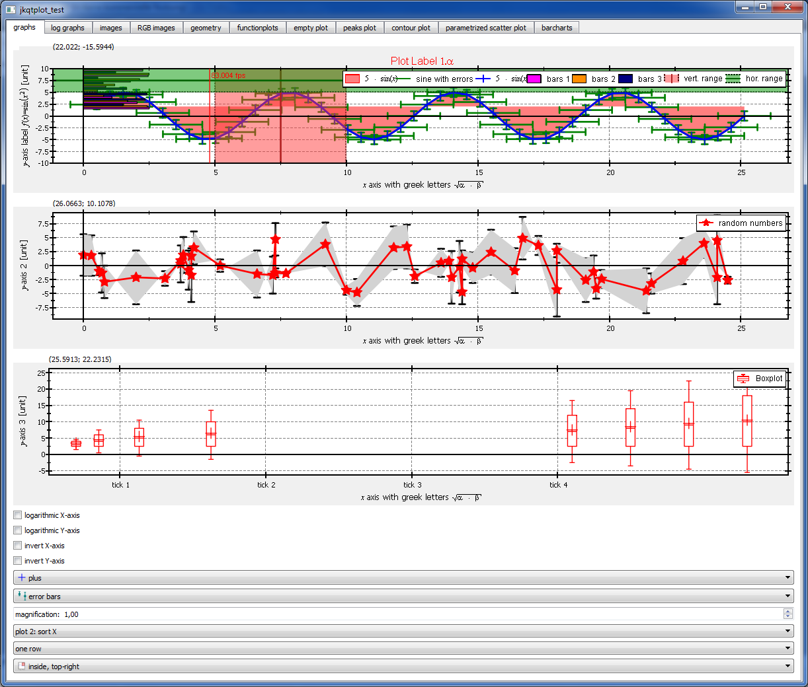

## Different Types of Barcharts

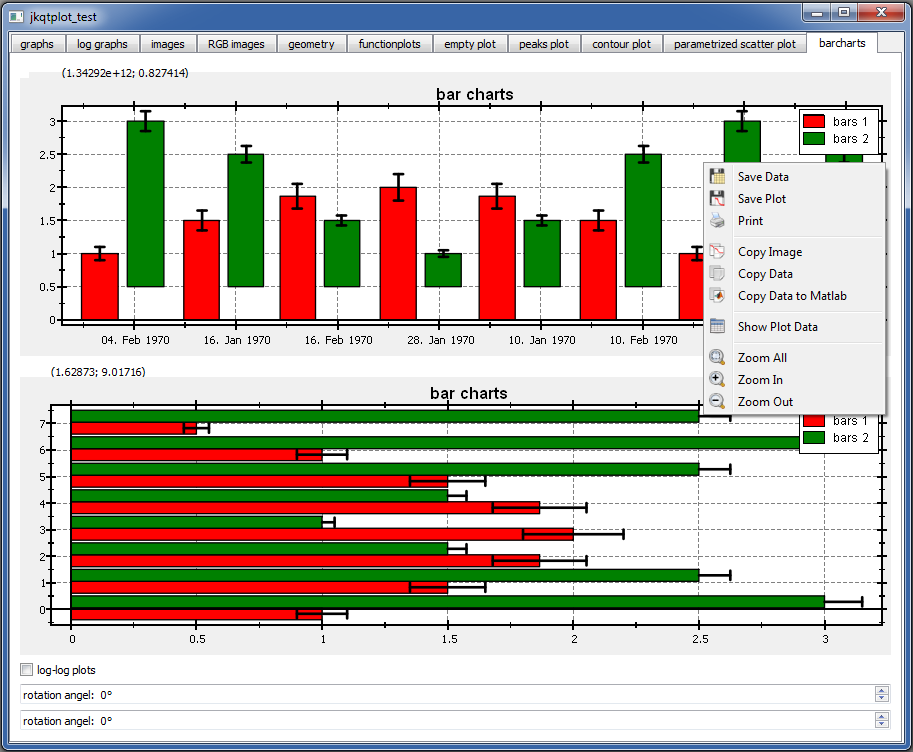

## Image Plots
You can plot C-arrays as images in different color-coding styles. Diferent Overlays/masks are also available. Finally you can use LaTeX markup to format any axis/plot/tick/... label. there is an internal LaTeX parser in this package.

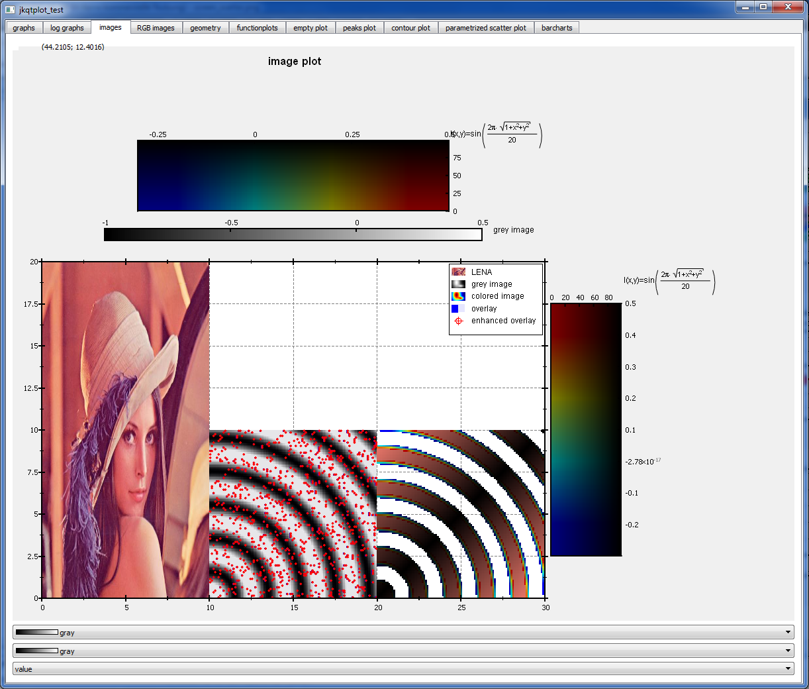

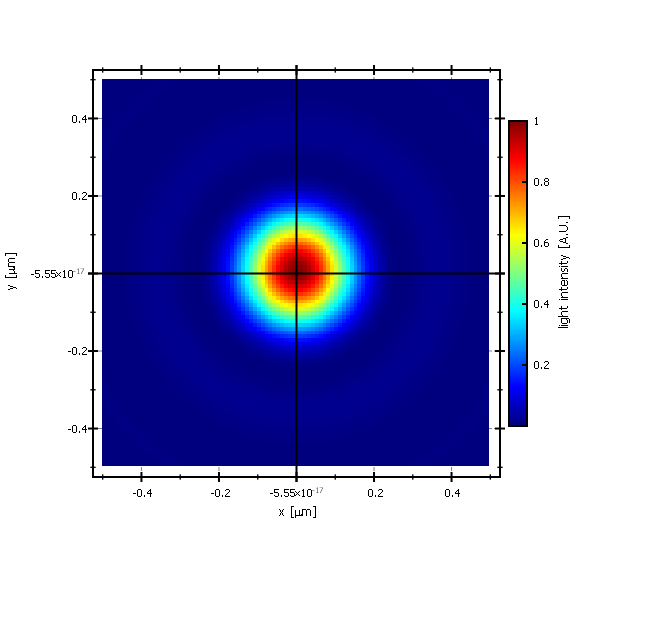

## Plotting a user-defined (parsed) function
Yes, a complete math expression parser is contained!

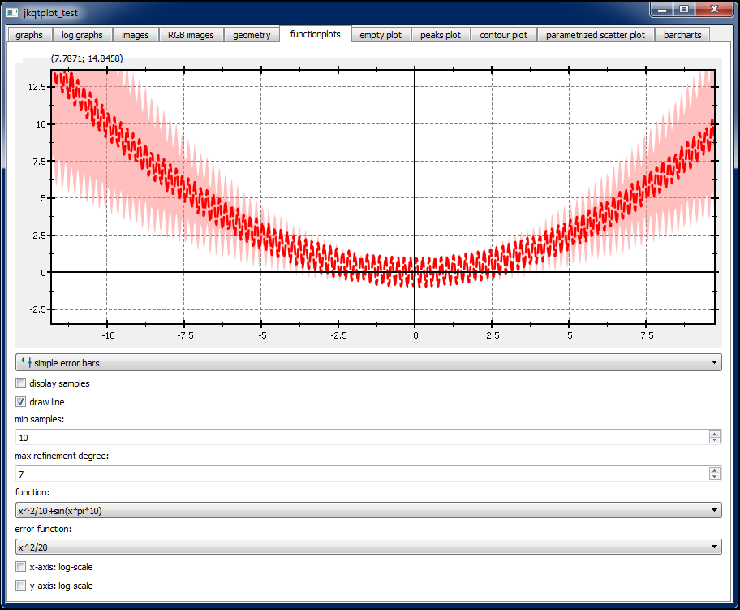

## Axis-Label styles in LogLog-Plot

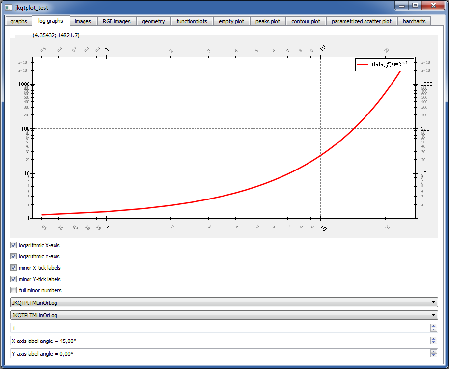

## Parametrized Scatter Plots and Data Viewer
Scatter Plots can have symbols where the shape/color/size is parametrized by a data column. Also the plotter is built around an internal datastore, which you can access (readonly!!!) by a data-viewer that is accessible from the contextmenu in any plot.

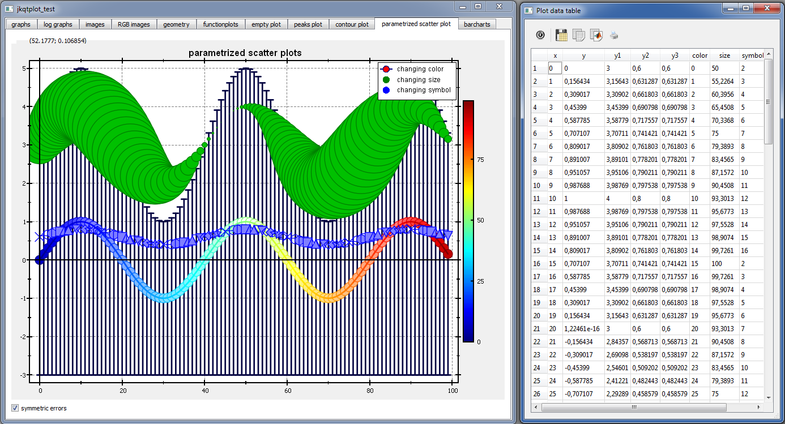

## Barcharts

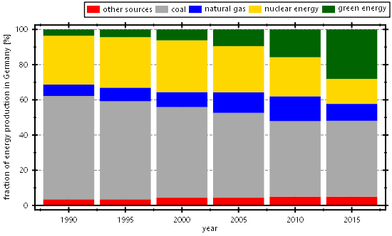
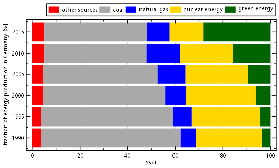
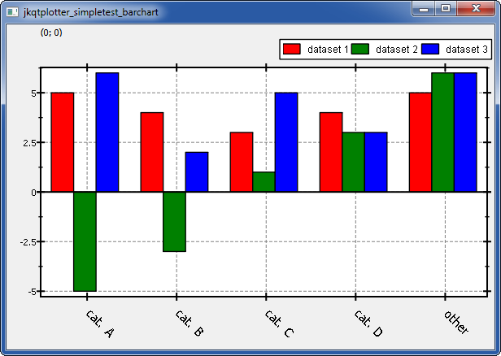

## Screenshots of included LaTeX renderer

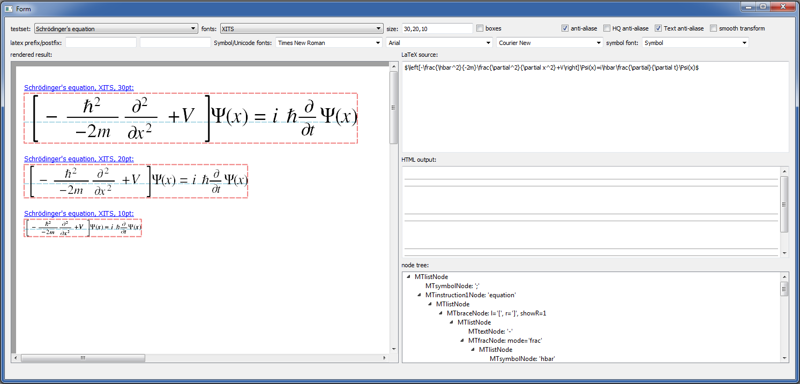
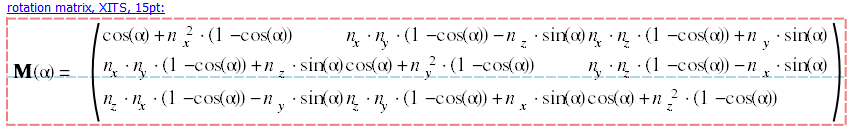
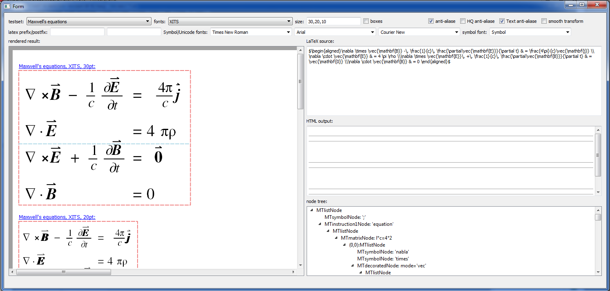
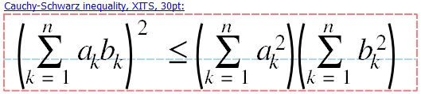
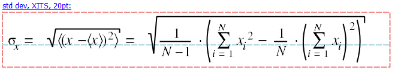

## QuickFit 3.0 Screenshots
The library JKQtPlotter was developed initially as a central part of the data evaluation software for biophysics [QuickFit 3.0](https://github.com/jkriege2/QuickFit3). The latter makes heavy use of `JKQtPlotter`, `JKQtMathText` and `JKQtFastPlotter`:

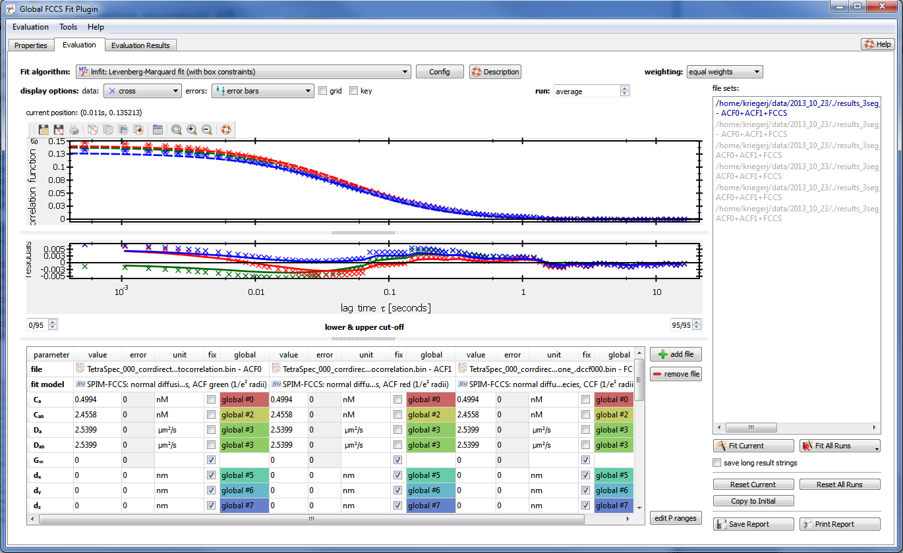
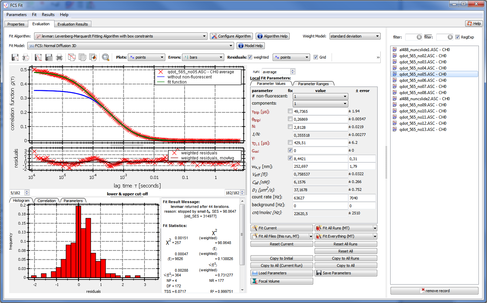
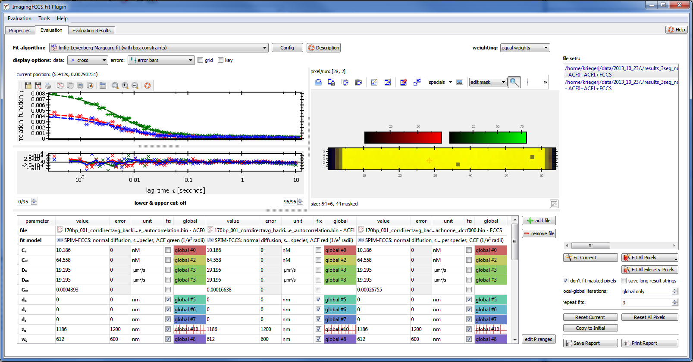
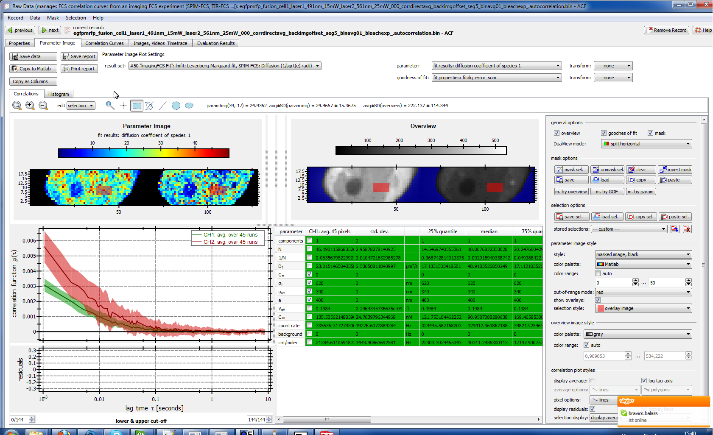

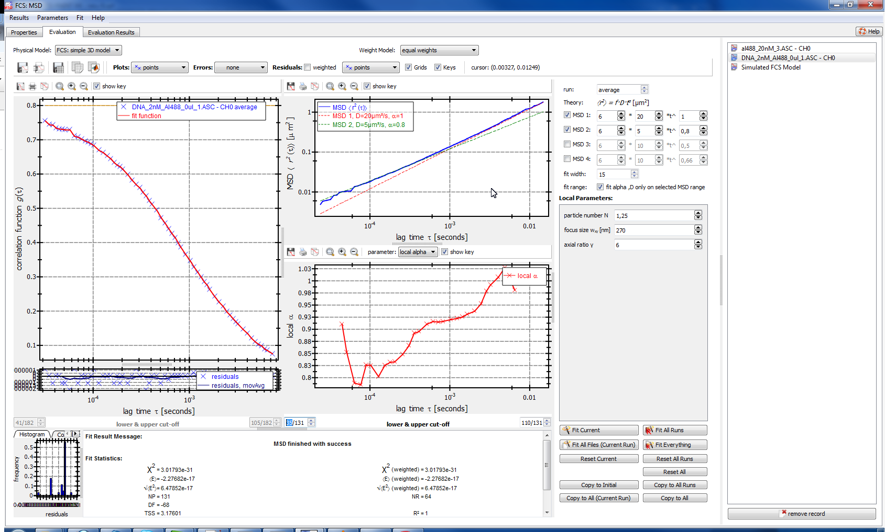

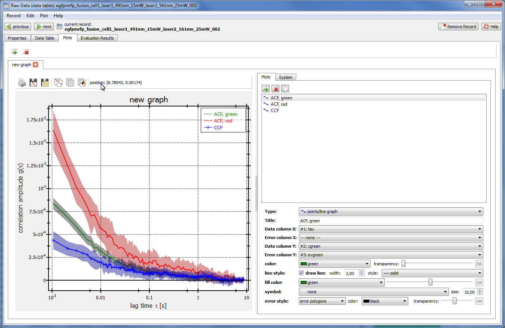

